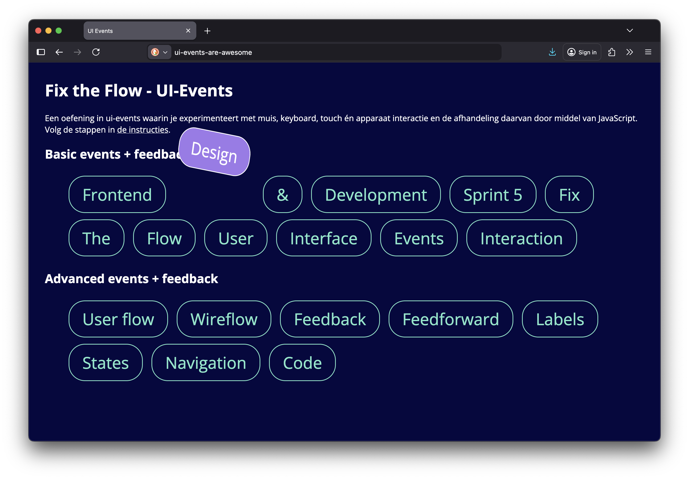

# User Interface Events

Een oefening in UI Events, waarin je experimenteert met muis, keyboard, touch én apparaat interactie en de afhandeling daarvan door middel van JavaScript en het geven van goede _feedback_.

## Doel van deze opdracht

In het college S05W2-01-User-Interface-Events wordt deze opdracht uitgelegd.

Op websites zijn veel verschillende vormen van interactie met gebruikers mogelijk. Deze worden *User Interface Events* (UI Events) genoemd. Als frontender wordt je geacht deze _events_ te beheersen, en goede _feedback_ te geven.

## Werkwijze

In onderstaande afbeelding zie je 20 verschillende links, elke link wordt een andere gebruikersinteractie en animatie.

In deze opdracht experimenteer je met verschillende UI events en gaandeweg leer je de mogelijkheden van de browser beter kennen. 
Zoek niet naar kant-en-klare oplossingen op Internet, maar werk ze zelf stap-voor-stap uit. Daar leer je het meest van.

Fork eerst deze repository naar jouw eigen GitHub account, en Clone deze naar je eigen computer. Zet Issues aan, publiceer de repository alvast op GitHub Pages, en zorg dat je een live link bij About hebt staan.

De eerste interactie (met een _click_ event) hebben we al voor je voorgedaan: als je op het 2e linkje (“Design”) klikt, springt deze omhoog. 
Je gaat nu voor de overige links ook interacties bedenken, maken en bespreken met een mentor.

Omdat deze deeltaak uit maximaal 20 kleinere taken (er zijn namelijk nog 19 elementen!) bestaat, doorloop je voor elke nieuwe interactie die je gaat maken de _Development Lifecycle_. 
Je gaat voor elke interactie een issue aanmaken en alle stappen doorlopen.
Ze zijn opgebouwd van simpel naar steeds moeilijker. 

### Analyseren

Maak per interactie een nieuw issue aan, en geef deze de titel van je UI event, het linkje dat deze triggert, en de feedback die de gebruiker krijgt (bijvoorbeeld “Laat de Design link springen als je erop klik”). 

Onderzoek de interactie die je gaat maken. 
Link naar specifieke bronnen die je denkt nodig te hebben, en beschrijf in eigen woorden hoe je dit probleem denkt op te gaan lossen.

#### Hints en verwachting per link

##### Basic events + feedback

1. **Frontend**: Click → scale animatie (hint: transform scale)
2. **Design**: Click → jump animatie (krijg je van ons)
3. **&**: Click → translate animatie (hint: translate)
4. **Development**: Double click → shake animatie
5. **Sprint** 5: Focus → kleuren animatie
6. **Fix**: Mouseover → verander tekst in de link (hint: textContent)
7. **The**: Mouseout → rotate animatie
8. **Flow**: Mousedown en mouseup → flip en terug
9. **User**: Keyup → kleur veranderen op basis van ingedrukte letter (hint: event.key)
10. **Interface**: Keydown → blaas de link op als een ballon, en laat leeglopen als je het toetsenbord loslaat
11. **Events**: Wheel of scroll → typografie wordt groter of kleiner, afhankelijk van hoe je scrollt (hint: delta)
12. **Interaction**: Mousemove → radial gradient die de muis volgt (hint: event.clientX, event.clientY & style.setProperty)

##### Advanced events + feedback

13. **User flow**: Mousemove → de overige elementen vallen naar beneden
14. **Wireflow**: Long press → linear gradient animatie
15. **Feedback**: 10x klikken → verander de button kleur
16. **Feedforward**: Escape toets indrukken op deze link → alle andere links worden grijs
17. **Labels**: Deviceorientation of devicemotion → shake alle links
18. **States**: Drag & drop → plaats deze link ergens anders
19. **Navigation**: Deze link wil heel graag geklikt worden → speel een geluid als dat lukt
20. **Code**: Deze link wil niet geklikt worden → sluit de pagina als dat toch lukt

#### Bronnen

- [Microinteraction @ Dribbble](https://dribbble.com/search/microinteraction)
- [Introduction to events @ MDN](https://developer.mozilla.org/en-US/docs/Learn/JavaScript/Building_blocks/Events)

### Ontwerpen

Maak eerst een snelle schets van de interactie en de feedback die je de gebruiker wilt geven.

Onderzoek hoe je de interactie zou kunnen bouwen. 
Maak een breakdownschets om te onderzoeken welke JS en CSS je nodig hebt. 
Zoek niet naar kant-en-klare oplossingen op Internet, maar werk ze zelf stap-voor-stap uit. 
Gebruik onderstaande bronnen.
Vraag een mentor of docent om hulp als je er niet uit komt. 
Samenwerken mag natuurlijk, maar het gaat om de oefening en het leren daarvan, niet het eindresultaat.

Voeg je schetsen toe als comment op je issue, en link naar bronnen die je gebruikt hebt of gaat gebruiken.

#### Bronnen

- [Interactions: thinking & sketching them. @ UX-Planet](https://uxplanet.org/interactions-thinking-sketching-them-f3d4c1d11149)
- [Mouse Events in Javascript @ Kirupa](https://www.kirupa.com/html5/mouse_events_in_javascript.htm)
- [Working with the Keyboard @ Kirupa](https://www.kirupa.com/html5/keyboard_events_in_javascript.htm)
- [How to Apply Disney’s 12 Principles of Animation to UI Design @ interaction-design.org](https://www.interaction-design.org/literature/article/ui-animation-how-to-apply-disney-s-12-principles-of-animation-to-ui-design)
- [Animations @ web.dev](https://web.dev/learn/css/animations)
- [querySelector @ MDN](https://developer.mozilla.org/en-US/docs/Web/API/Document/querySelector)
- [classList @ MDN](https://developer.mozilla.org/en-US/docs/Web/API/Element/classList) 
- [UI Events @ MDN](https://developer.mozilla.org/en-US/docs/Web/API/UI_Events)

### Bouwen

Implementeer de interactie door `main.js` en `style.css` aan te vullen met jouw code. Denk telkens na over nieuwe namen voor CSS classes en variabelen in JS, zodat je eerder gemaakte code niet breekt!

Het kan helpen om je _feedback_ eerst in CSS uit te werken, en deze daarna pas met een UI Event te starten, door bijvoorbeeld een `class` te wijzigen. Kijk nog eens naar [het driestappenplan in JavaScript](https://github.com/fdnd-task/fix-the-flow-interactive-website/blob/main/docs/programming-user-interaction.md#het-3-stappenplan-waarmee-je-bijna-alles-kan), en de voorbeelden in `main.js`.

Vergeet ook niet dat je in JavaScript alles stap voor stap moet doen. Het kan helpen om hierbij eerst [in commentaar je plan uit te schrijven](https://github.com/fdnd-task/fix-the-flow-interactive-website/blob/main/docs/programming-user-interaction.md#van-comments-naar-code).

Tip: Gebruik in JavaScript regelmatig `console.log()` om te controleren of alles werkt zoals je verwacht.

### Integreren

Commit jouw code met de interactie die je zojuist geïmplementeerd hebt, en noem in je commit message je interactie en het issue nummer waar je aan werkt.

Heb je per ongeluk aan meerdere interacties tegelijk gewerkt, zonder te committen? Onderzoek dan eens hoe Partial Commits je nu en in de toekomst kunnen gaan helpen.

Push daarna je code naar GitHub.

### Testen

Test in een browser of de versie die je net online gezet hebt ook via GitHub Pages werkt.

Open jouw repository via de directe link en check of alles werkt.

Laat jouw interactie ook testen door een klasgenoot en een mentor, en laat ze allebei feedback geven op jouw issue.

Schrijf als reactie op je issue heel kort op wat je opviel bij het testen.

Sluit daarna het issue, en ga door met de volgende interactie (door opnieuw te Analyseren).

## Definition of done

Deze opdracht is done als:

- [ ] Je hebt de 12 basis interacties stap voor stap voltooid, en je voortgang, breakdown schetsen en testresultaten zijn in issues opgenomen.
- [ ] Optioneel: Je hebt enkele of alle advanced interacties stap voor stap voltooid, en je voortgang, breakdown schetsen en testresultaten zijn in issues opgenomen.
